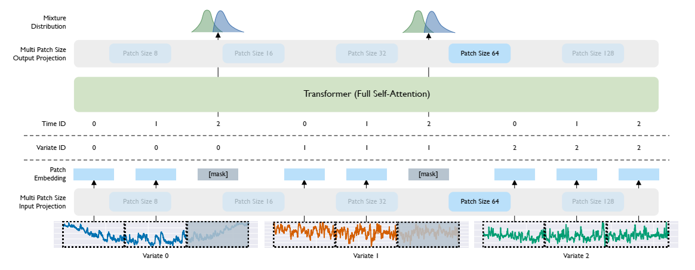

# **MOIRAI - Zero/Few-Shot Evaluation of Moirai Foundation Models**
[](https://www.python.org/downloads/)
[](https://arxiv.org/abs/2402.02592)
[](https://huggingface.co/collections/Salesforce/moirai-r-models-65c8d3a94c51428c300e0742)
[](https://opensource.org/licenses/Apache-2.0)



## **1. Project Overview and Objectives**

This project investigates the forecasting capabilities of **Salesforce's Moirai**, a Masked Encoder-based Universal Time Series Forecasting Transformer. The primary objective is to evaluate whether a general-purpose foundation model can outperform robust statistical baselines on domain-specific real-world data without task-specific fine-tuning.

**Key Objectives:**
* **Foundation Model Investigation:** Assess Moirai-Small (14M) and Moirai-Base (311M) in Zero-Shot and Few-Shot modes.

* **Real-World Application:** Applied to two distinct domains: Financial (SPY ETF) and Environmental (AQI Los Angeles).

* **Rigorous Evaluation:** Implemented rolling-origin cross-validation (backtesting) to prevent data leakage.

* **Baseline Comparison:** Benchmarked against ETS (Error, Trend, Seasonality) and Seasonal Naive models.

---

## **📂 Repository Structure**
The codebase is modularized to ensure reproducibility and clarity.
```bash
moirai-time-series-project/
├── .venv/                            # (local) virtual environment
├── configs/
│   └── config.yaml                   # Configurations setup
│
├── datasets/
│   ├── SPY.csv                       # Cached Yahoo Finance data
│   └── AQI.csv                       # Cached AQI data
│
├── notebooks/
│   ├── exp-pull-data.ipynb           # Data EDA
│   ├── moirai-aqi-environment.ipynb  # Moirai on AQI
│   ├── moirai-spy-environment.ipynb  # Moirai on SPY
│   └── exp-execution.ipynb           # Notebook experiments
│
├── outputs/
│   ├── 01_spy_backtesting.png
│   ├── 01_aqi_la_backtesting.png
│   ├── 02_spy_horizon_error.png
│   ├── 02_aqi_la_horizon_error.png
│   ├── 03_spy_calibration.png
│   ├── 03_aqi_la_calibration.png
│   ├── 04_spy_overlay_prediction.png
│   ├── 04_aqi_la_overlay_prediction.png
│   ├── aqi_la_leaderboard.csv
│   └── spy_leaderboard.csv
│
├── src/
│   ├── __init__.py             # Marks src as a package
│   ├── dataloader.py           # load_data, get_splits
│   ├── baselines.py            # BaselineModels
│   ├── moirai_wrapper.py       # MoiraiPredictor wrapper
│   ├── evaluation.py           # rolling_cv, statistical_test
│   └── plotting.py             # All plotting utilities
│
├── .gitignore                  # Ignore venv, cache, outputs 
├── .python-version             # Python version (pyenv / uv)
├── main.py                     # Main experiment runner
├── pyproject.toml              # Project metadata
├── requirements.txt            # Runtime dependencies
├── uv.lock                     # Reproducible dependency lock
└── README.md                   # Project documentation
```
---

## **3. Data Documentation**

Two univariate time series were selected to test robustness across different behaviors (stochastic vs. seasonal).

| Dataset | Source | Frequency | Length | Characteristics |
| :--- | :--- | :--- | :--- | :--- |
| **SPY** | Yahoo Finance | Daily (Business) | ~2500 steps | Financial, Stochastic, High Noise |
| **AQI_LA** | Open-Meteo (EPA) | Daily | ~800 steps | Environmental, Strong Seasonality, Bounded |

* **Missingness:** Minimal. Imputed via linear interpolation where necessary.
* **Splits:** Train, Validation (3-Fold Rolling CV), Test.
* **Pre-processing:** No manual scaling was applied. The model utilizes internal Reversible Instance Normalization (RevIN).

---

## **4. Experimental Protocol**

### **4.1 Problem Setup**
* **Forecast Horizon ($H$):** 14 Days.
* **Seasonality ($m$):** 5 (SPY - Weekly Business), 7 (AQI - Weekly).
* **Evaluation Strategy:** Rolling-origin cross-validation with 3 folds on the validation set.

### **4.2 Models Evaluated**
1.  **Moirai-Small:** 14M Parameters. Tested in Zero-Shot (Context=60) and Few-Shot (Context=240).
2.  **Moirai-Base:** 311M Parameters. Tested in Zero-Shot (Context=60) and Few-Shot (Context=240).
3.  **ETS:** Exponential Smoothing (Error, Trend, Seasonal).
4.  **Seasonal Naive:** Baseline ($y_t = y_{t-m}$).

### **4.3 Metrics**
* **Point Forecast:** Mean Absolute Error (MAE), Root Mean Squared Error (RMSE), Mean Absolute Scaled Error (MASE).
* **Probabilistic:** Pinball Loss (Quantile 0.5), Interval Coverage.
* **Significance:** Wilcoxon Signed-Rank Test.

---

## **5. Usage & Reproducibility**

### **Installation - Create Virtual Environment (Recommended)**

This project uses **uv** for fast, reproducible dependency management.

```bash
# Clone the repository
git clone https://github.com/ndrhmdk/foundation-moirai-time-series-forecasting.git

# Create virtual environment with Python 3.11
uv venv .venv --python 3.11

# Activate
.venv\Scripts\activate        # Windows
source .venv/bin/activate     # Linux / macOS

# Install dependencies
uv pip install -r requirements.txt
```

### **Running the Experiment**
To reproduce the results for a specific dataset, run the `main.py` script.

**For Financial Data (SPY):**
```bash
uv run python main.py --dataset SPY
```

**For Environmental Data (AQI):**
```bash
uv run python main.py --dataset AQI_LA
```

**Random Seeds:**
- Global seed set to `42` in [`config.yaml`](configs/config.yaml) to ensure deterministic splits and initialization.

## **6. Results Summary**
- **SPY (Financial)**
  - **Winner**: ETS.
- **AQI (Environmental)**
  - **Winner**: Moirai-Small (Few-Shot)

*Detailed tables and plots are generated in the `outputs/` directory upon execution*.

## **7. Model Card**
- **Model Name**: Salesforce Moirai (`1.1-R-Small` / `1.1-R-Base`).
- **Version**: Hugging Face `uni2ts` implementation.
- **Intended Use**: Universal time series forecasting. Best suited for domains with clear seasonality or physical patterns.
- **Limitations**
  - **Context Window**: Fixed context length (tested 60-240). Performance may degrade if relevant history exceeds this window.
  - **Stochasticity**: Struggles with Random Walk data (e.g., Finance) where history is not predictive of future returns.
- **Failure Modes**: High volatility events outside the training distribution (e.g., COVID crash in SPY data).

## **References**
1. **Moirai Paper**: [Woo et al.](https://arxiv.org/abs/2402.02592), "Unified Training for Universal Time Series Forecasting Transformers", arXiv 2024. 
2. **Uni2TS Library**: [uni2ts](https://github.com/SalesforceAIResearch/uni2ts).

3. **Baselines**: Statsmodels & SciKit-Learn.

